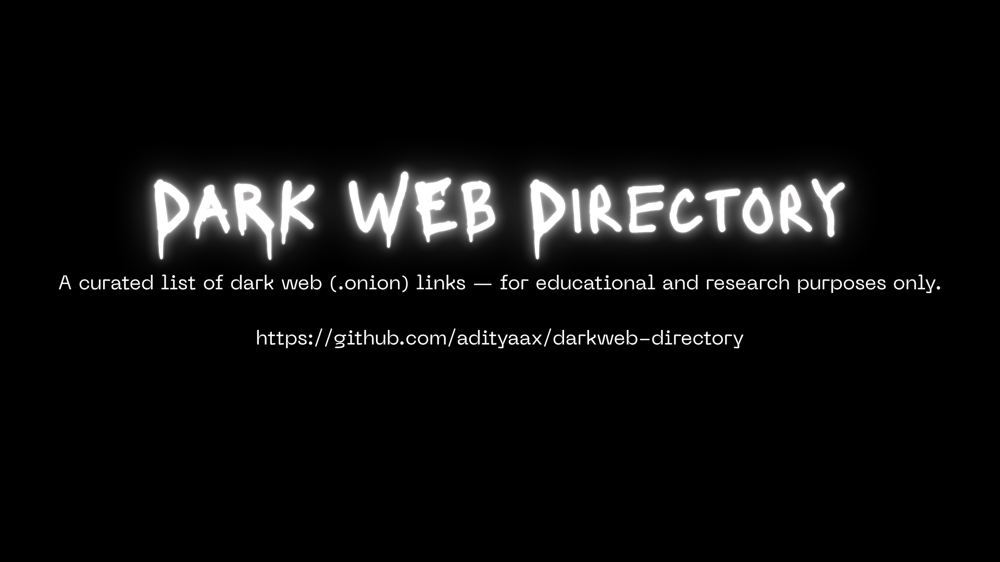

# Dark Web Directory (Educational Purposes)

This repository curates publicly accessible Tor (.onion) resources such as news outlets, forums, whistleblowing platforms, and directories — strictly for educational, research, and academic use.

## 📌 Disclaimer
This repository is maintained for informational and educational use only. Always follow your local laws. We **do not host, promote, or link to illegal content**. Use of any links or tools is at your own risk.

We are **not responsible** for the content of external sites. Always verify links independently before visiting.

## ⚠️ General Reminders for Users

- Always use the official [Tor Browser](https://www.torproject.org/) to access .onion links.
- **Do not engage in illegal activity.** This repository is for **educational, journalistic, and research purposes only**.
- Some .onion services may host or link to harmful or illicit content. **Browse responsibly and avoid engaging with such sites.**
- Protect your identity — do not share personal information on dark web platforms.
- Verify onion URLs from trusted sources to avoid phishing or scam sites.
- Consider using **Tails OS** or other privacy-focused systems for enhanced anonymity.
- Practice good **OpSec (Operational Security)** while exploring the dark web.

## 📝 NOTE
We strive to ensure that every link listed is active and functional. However, if you encounter any broken or outdated links, please consider opening an issue or submitting a pull request with the correct information.

## 📁 Categories
- [Advertisement Services](https://github.com/adityaax/darkweb-directory/blob/main/links/advertisement-services.md)
- [Anonymous File Sharing Services](https://github.com/adityaax/darkweb-directory/blob/main/links/anonymous-file-sharing.md)
- [Blogs & Personal Pages](https://github.com/adityaax/darkweb-directory/blob/main/links/blogs-personal-pages.md)
- [Chat Rooms](https://github.com/adityaax/darkweb-directory/blob/main/links/chat-rooms.md)
- [Conferences Sites](https://github.com/adityaax/darkweb-directory/blob/main/links/conference-sites.md)
- [Cryptocurrency Platforms](https://github.com/adityaax/darkweb-directory/blob/main/links/cryptocurrency-platforms.md)
- [Onion Link Directories](https://github.com/adityaax/darkweb-directory/blob/main/links/directories.md)
- [Email Services](https://github.com/adityaax/darkweb-directory/blob/main/links/email-services.md)
- [Forums](https://github.com/adityaax/darkweb-directory/blob/main/links/forums.md)
- [Hosting Providers](https://github.com/adityaax/darkweb-directory/blob/main/links/hosting-providers.md)
- [Libraries & Books](https://github.com/adityaax/darkweb-directory/blob/main/links/libraries-books.md)
- [News Outlets](https://github.com/adityaax/darkweb-directory/blob/main/links/news.md)
- [Open Source Tools](https://github.com/adityaax/darkweb-directory/blob/main/links/open-source-tools.md)
- [Others Section](https://github.com/adityaax/darkweb-directory/blob/main/links/others-section.md)
- [Paste Sites](https://github.com/adityaax/darkweb-directory/blob/main/links/paste-sites.md)
- [Privacy Platforms](https://github.com/adityaax/darkweb-directory/blob/main/links/privacy-platforms.md) 
- [Search Engines](https://github.com/adityaax/darkweb-directory/blob/main/links/search-engines.md)
- [Social Sites](https://github.com/adityaax/darkweb-directory/blob/main/links/social-platforms.md)
- [Whistleblowing Platforms](https://github.com/adityaax/darkweb-directory/blob/main/links/whistleblowing.md)

## 🔍 Usage
You need Tor Browser to access `.onion` links: [Tor Browser](https://www.torproject.org/download/)

## 🤝 Contributors

Thanks to everyone who has contributed to this repository:

[@fraklinde3mon](https://github.com/fraklinde3mon)\
[@nopara73](https://github.com/nopara73)

## 📬 Contributing
Please read [CONTRIBUTING.md](./CONTRIBUTING.md) before submitting new links.

## 🙌 Support
If you find this useful, give the repo a ⭐ and share it with fellow researchers.
