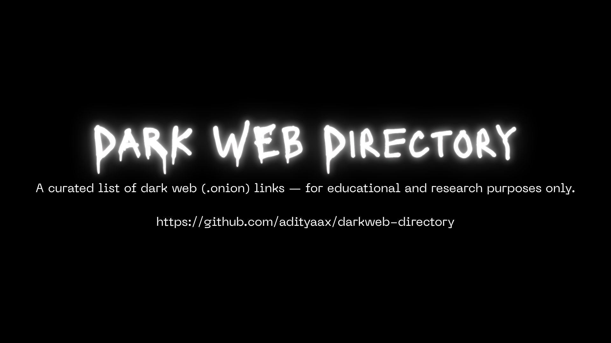

# Dark Web Directory (Educational Purposes)

This repository curates publicly accessible Tor (.onion) resources such as news outlets, forums, whistleblowing platforms, and directories — strictly for educational, research, and academic use.

## 📌 Disclaimer
This repository is maintained for informational and educational use only. Always follow your local laws. We **do not host, promote, or link to illegal content**. Use of any links or tools is at your own risk.

We are **not responsible** for the content of external sites. Always verify links independently before visiting.

## ⚠️ General Reminders for Users

- Always use the official [Tor Browser](https://www.torproject.org/) to access .onion links.
- **Do not engage in illegal activity.** This repository is for **educational, journalistic, and research purposes only**.
- Some .onion services may host or link to harmful or illicit content. **Browse responsibly and avoid engaging with such sites.**
- Protect your identity — do not share personal information on dark web platforms.
- Verify onion URLs from trusted sources to avoid phishing or scam sites.
- Consider using **Tails OS** or other privacy-focused systems for enhanced anonymity.
- Practice good **OpSec (Operational Security)** while exploring the dark web.

## 📝 NOTE
We strive to ensure that every link listed is active and functional. However, if you encounter any broken or outdated links, please consider opening an issue or submitting a pull request with the correct information.

## 📁 Categories
- Blogs & Personal Pages
- Onion Link Directories
- Email Services
- Forums (only legal/general discussion)
- Hosting Providers
- Libraries & Books
- News Outlets
- Paste Sites 
- Search Engines
- Whistleblowing Platforms

## 🔍 Usage
You need Tor Browser to access `.onion` links: [Tor Browser](https://www.torproject.org/download/)

## 📬 Contributing
Please read [CONTRIBUTING.md](./CONTRIBUTING.md) before submitting new links.
